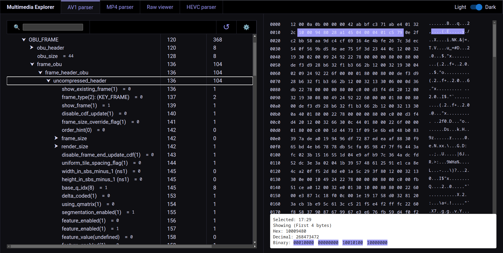

# Multimedia Explorer

A browser based AV1, HEVC, MP4, IVF bitstream parser.

Features:
1. *Auto detect* and parse AV1/HEVC data from *MP4 and IVF* containers.
2. Unpack and download raw bitstream from MP4/IVF file.
2. In browser parsing. Data is not sent to any server.

Live App: https://mdakram.com/media-parser-gui/

#### AV1 Demo
https://mdakram.com/media-parser-gui/#/av1


#### HEVC Demo
https://mdakram.com/media-parser-gui/#/hevc


#### MP4 Demo
https://mdakram.com/media-parser-gui/#/mp4


## Usage

To install and start, follow these steps:

```bash
# Get the code
git clone https://github.com/mdakram28/media-parser-gui.git
cd media-parser-gui
# Build
npm install
# Run
npm start
```

## License

This project is licensed under the MIT License - see the [LICENSE.md](LICENSE.md) file for details


