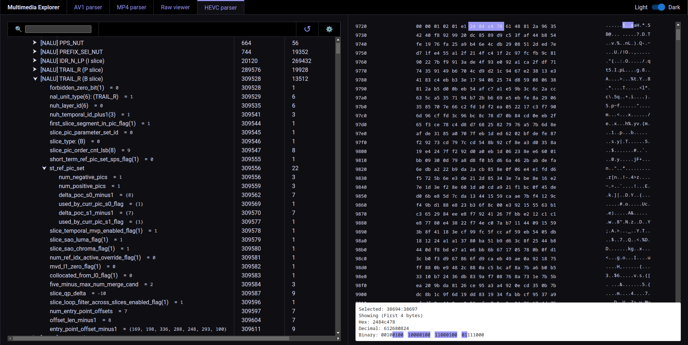

# av1-parser-gui

A browser based AV1, HEVC and MP4 bitstream parser and visualizer capable of handling large files.
Live App: https://mdakram.com/av1-parser-gui/

### Preview

#### AV1 Demo
https://mdakram.com/av1-parser-gui/#/av1


#### MP4 Demo
https://mdakram.com/av1-parser-gui/#/mp4


#### HEVC Demo
https://mdakram.com/av1-parser-gui/#/hevc



## Usage

To install and start, follow these steps:

```bash
# Get the code
git clone https://github.com/mdakram28/av1-parser-gui.git
cd av1-parser-gui
# Build
npm install
# Run
npm start
```

## AV1 Input

For the AV1 parser, the input needs to be a raw AV1 bitstream.
You can extract the raw bitstream from a .mp4/.mov or any other container by using ffmpeg:

```bash
ffmpeg -i my/input/video.mp4 -t 2 -c:v copy -copy_unknown bitstream.obu
```

Upload the bitstream in the GUI.